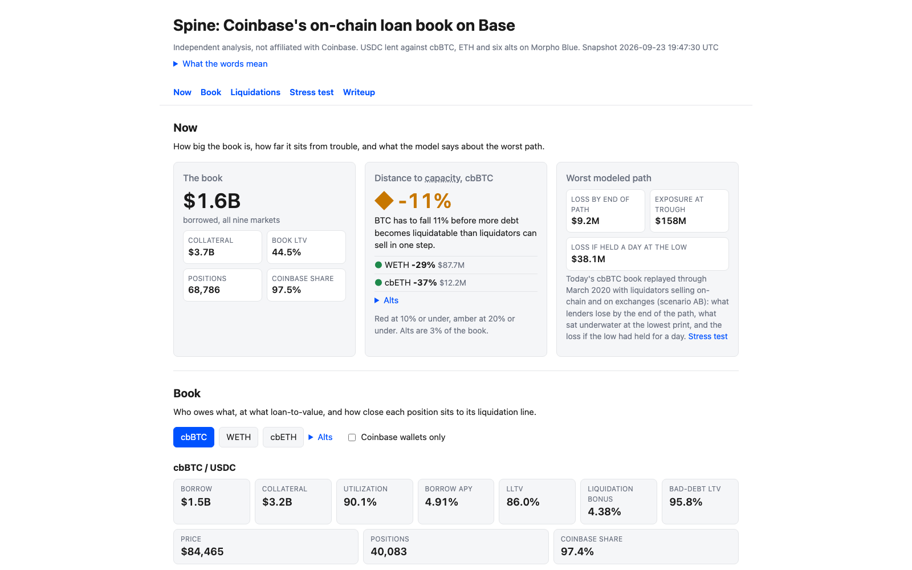

# Spine

[](https://github.com/RahilBhavan/spine/actions/workflows/refresh.yml)
[](https://github.com/RahilBhavan/spine/actions/workflows/ci.yml)
[](LICENSE)
**Live dashboard: [spine.rahilbhavan.com](https://spine.rahilbhavan.com)** (refreshes roughly hourly; GitHub cron is best-effort)

[](https://spine.rahilbhavan.com/site/)

Live risk dashboard and haircut backtest over the Morpho Blue markets on Base behind Coinbase's app loans.

Independent analysis from public on-chain data. Not affiliated with or endorsed by Coinbase or Morpho.

## What it answers

Coinbase's app routes USDC loans against cbBTC and ETH to Morpho markets on Base, funded by Morpho vault suppliers, at an 86% liquidation LTV. Bad debt falls on those suppliers, not on Coinbase's balance sheet. As of 2026-09-19 the book was about $1.4B of debt against $2.9B of cbBTC across 39,000 positions (see the live dashboard for current figures), 97.5% of it Coinbase Smart Wallets. It has cleared $256M of liquidations across three real stress events with zero bad debt. Spine asks what happens on a path those events never tested: March 2020, where borrowers got 25 minutes of warning instead of hours.

The answer, from replaying today's book through seven historical crash paths with liquidator and borrower behavior calibrated on the lived events:

| Collateral | Today | Recommended | Why |
|---|---|---|---|
| cbBTC | 86% LLTV / 75% max draw | A committed backstop liquidator first; then 80% / 66-70% | March 2020 at 86%: $9M realized loss but $158M (10% of supply) underwater and unserved at the trough. Liquidator capital, not the haircut, is what binds |
| WETH | 86% / 75% | 77% / 70% | ETH gaps more than the 4.38% bonus inside five minutes; at 86% three of seven paths leave bad debt |
| Alts | 62.5% / 55% | 62.5%, max draw 47%, per-asset book cap | No on-chain venue on Base; every seized unit must clear through Coinbase's own book |

Full argument, every number reproducible from a script in this repo: [WRITEUP.md](WRITEUP.md). The writeup's changelog shows how the headline moved as the model was corrected, which is the part to read if you want to check the work.

## How it is built

- **Dashboard**: `site/index.html` (LTV distribution, liquidatable-vs-capacity curve, liquidation history, per market).
- **Writeup**: `WRITEUP.md` (argued haircuts per asset), rendered at `site/writeup.html`.
- **Plan and research**: `PLAN.md`, `research/`. Next steps: `ROADMAP.md`.
- **Codebase guide**: `CODEBASE_GUIDE.md` (architecture, design rationale, module tour, and a four-pass learning plan).

## Run

Setup: `uv venv .venv && uv pip install numpy pytest`. The positions files are not committed: on a fresh clone, `fetch_positions` must run first.

```
.venv/bin/python -m spine.fetch_positions      # all positions, 9 markets (~90s)
.venv/bin/python -m spine.fetch_liquidations   # every liquidation (~60s first run, incremental after)
.venv/bin/python -m spine.tag_coinbase         # Coinbase Smart Wallet tags via Multicall3
.venv/bin/python -m spine.fetch_prices         # Coinbase 5m candles for 7 crash windows (cached)
.venv/bin/python -m spine.fetch_depth          # CEX L2 depth + DEX quoter capacity (~3 min)
.venv/bin/python -m spine.fetch_vaults         # which vaults fund each market: V1 from the API, V2 on-chain (~40s)
.venv/bin/python -m spine.summarize            # -> data/summary.json for the site
.venv/bin/python -m http.server 8000           # then open http://localhost:8000/site/
```

Stress-test pipeline (slow, chunked; `fetch_oracle`, `calibrate`, `rebuild_book` and `backtest` take `--max-seconds` and resume):

```
.venv/bin/python -m spine.fetch_oracle                     # Chainlink AnswerUpdated paths for the lived events
.venv/bin/python -m spine.calibrate Feb2026; ... ; .venv/bin/python -m spine.calibrate   # realized latency/bonus/throughput
.venv/bin/python -m spine.rebuild_book cbBTC 2026-02-03 2026-06-01 2025-10-09      # historical books from events
.venv/bin/python -m spine.backtest calib && .venv/bin/python -m spine.backtest grid --market cbBTC   # etc.
```

Fetchers are stdlib only; `backtest.py` needs numpy. The GitHub Actions workflow refreshes the live data roughly hourly (GitHub cron is best-effort) and deploys to Pages. It also publishes the static site and generated data on the `data` branch, which Vercel serves at `spine.rahilbhavan.com`.
`main` holds one frozen snapshot of the generated files in `data/` so a fresh clone renders and tests pass. The live site and the `data` branch (a single commit, replaced each run) hold the latest data.
The hourly job also opens a GitHub issue (`spine.alert`) when any market's distance to capacity is 10% or under; closing the issue acknowledges it, and a new one opens on the next hour the condition holds.

## Citing or reusing

MIT licensed. If you use the calibration numbers (liquidator latency, full-close rate, daily capacity) or the borrower-response fit, cite the writeup by date; the data snapshot in `data/` is what the tables were printed from. Issues and pull requests are welcome, especially historical order-book depth for the crash windows, which is the least-known input.

## Related projects

- [mara-credit-case](https://github.com/RahilBhavan/mara-credit-case): a credit committee case on a $5M secured revolver to MARA Holdings.
- [coin-revenue-bridge](https://github.com/RahilBhavan/coin-revenue-bridge): a Q3 to Q4 2024 Coinbase consumer revenue bridge from SEC filings.
- [x402-exception-desk](https://github.com/RahilBhavan/x402-exception-desk): a synthetic x402 payment exception desk.
- All four projects: [rahilbhavan.com/crypto-finance](https://rahilbhavan.com/crypto-finance).
